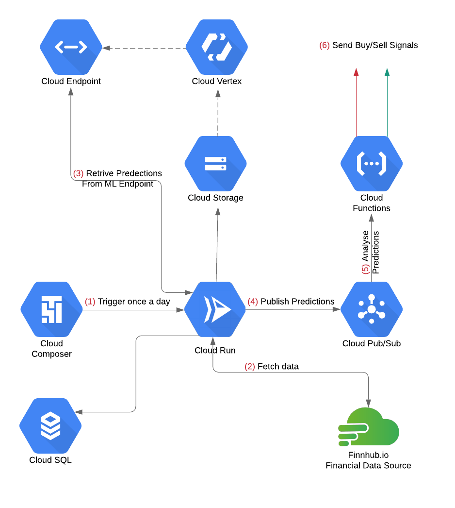

# Smart Trader 

    </img>

Smart trader is a project idea that helps the user make better decisions buying and selling crypto coins using machine learning models. The ML model have been trained on cloud Vertex AI and an endpoint was made there to fetch predictions when needed. Cloud composer would trigger the main app that runs on Cloud Run once a day (to reduce costs). The main app then would fetch the updated data from finnhub.io and store them in both MySQL server and Cloud Storage. After that, it will send the lastest data to the machine learning endpoint to retrive price predictions for the next day. The predictions gets published immediately through Cloud Pub/Sub, and that would trigger the cloud function that is subscribed to this 

#### Models/Analysis
- Lab Report Data Extraction
    - Aims to unlock data from disparate, unconfirmed PDF to make it actionable for research and analysis in an automated fashion
- Release Risk Model
    - Aims to predict the risk of a hazardous PFAS chemical releases in an area of the state so that MassDEP could proactively focus on the area of higher risks
- Well Exposure Risk Model 
    - Aims to predict the risk of PFAS exposure to a private well in an area assuming a release in the area has occurred assisting MassDEP to prioritize testing of wells that have higher likelihood of getting PFAS. 
- Source Attribution Analysis 
    - Aims to identify likely contamination sources responsible for PFAS release at disposal sites, based on the signature profile of detected PFAS compounds to inform methods of prevention.  
#### Repository structure
~~~
├───art
├───data
    ├───disposal_sites
    ├───Extracted lab report data
    ├───features
    ├───modeling_data
    │   ├───release_risk
    │   ├───source_attribution
    │   │   ├───attribution modeling
    │   │   └───profiling
    │   └───well_exposure
    │       └───base_samples
    ├───private_wells
    └───residential
├───scripts
    ├───gis_feature_engineering
    ├───imputation
    │   ├───extracted_data
    │   ├───private_well
    ├───Lab report extraction
    ├───Release Risk Model
    ├───source_attribution_analysis
    │   ├───pfas18
    │   ├───pfas6
    └───Well Exposure Model
~~~

#### Acknowledgements
This work is done in partnership with the MassDEP and WPI DS GQP.  
Authors: Adam DiChiara, Dan Cher, Marwan Alsaedi, Karthik Deiveegarajan and Scott Tang  
Special Thanks to Matthew Fitzpatrick for all his tireless work in making this project possible.

  
   

