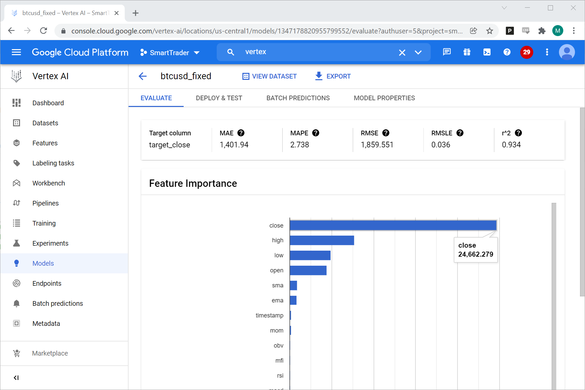
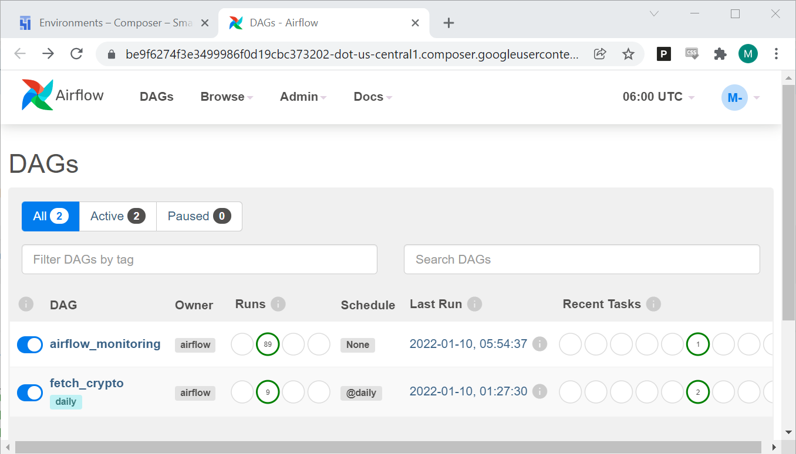

# Smart Trader 

    </img>

Smart trader is an app that helps the user make better decisions buying and selling crypto coins using machine learning models. The ML model have been trained on cloud Vertex AI and an endpoint was made there to fetch predictions when needed.

    </img>

Cloud composer would trigger the main app that runs on Cloud Run once a day (to reduce costs).

    </img>

The main app then would fetch the updated data from finnhub.io and store them in both MySQL server and Cloud Storage. After that, it will send the lastest data to the machine learning endpoint to retrive price predictions for the next day. The predictions gets published immediately through Cloud Pub/Sub, and that would trigger the cloud function that is subscribed to this topic to analyse the predictions and then sends the buy/sell signals.

